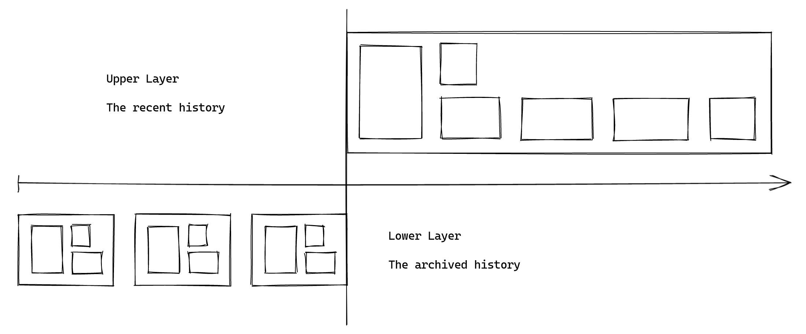
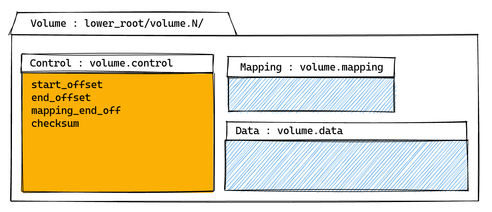
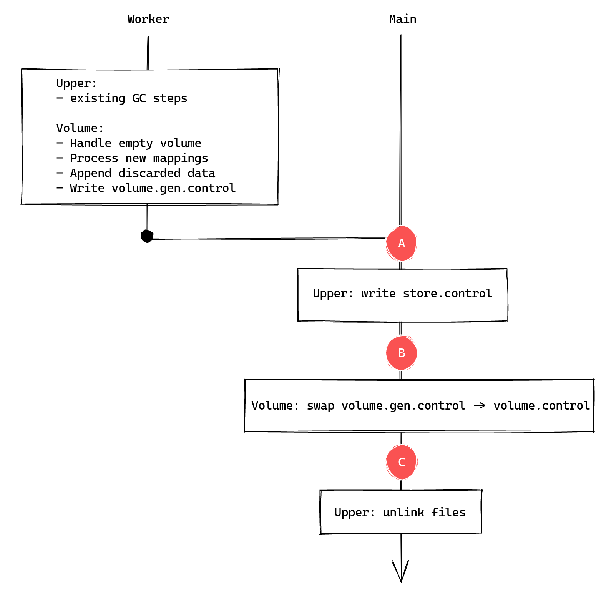
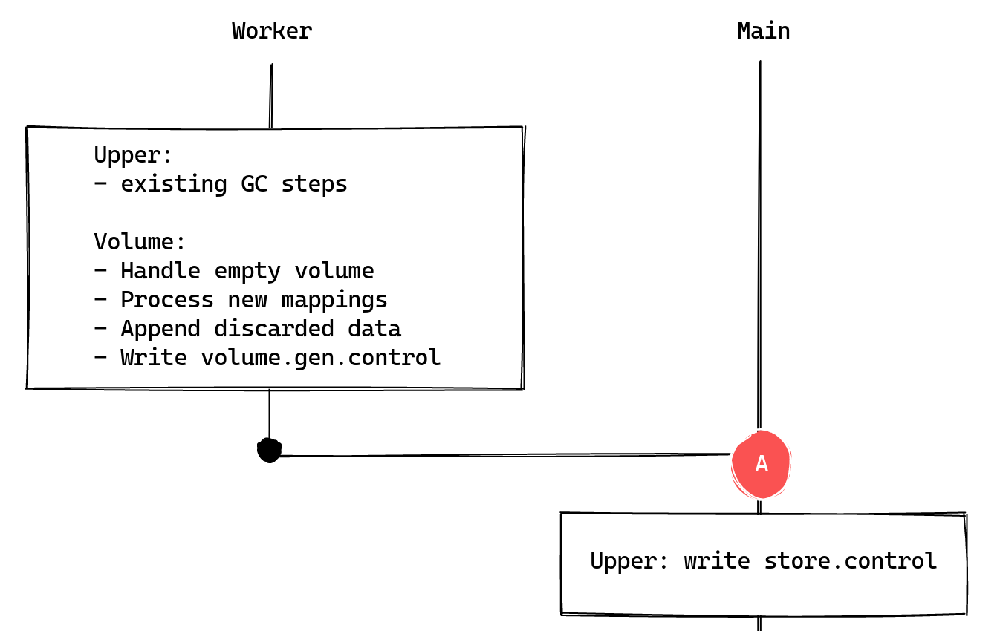
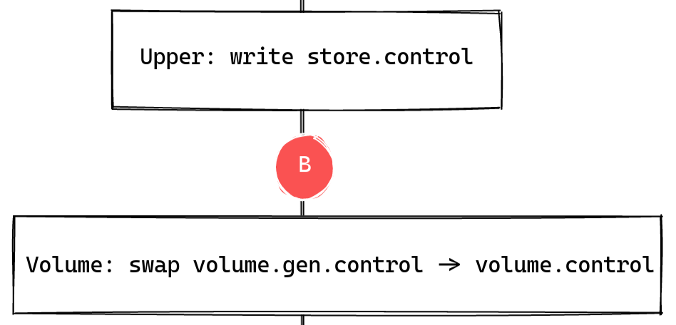
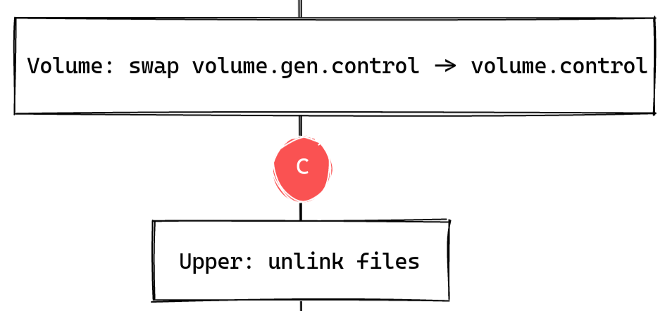

# Improving performance for unlimited history stores


Irmin 3.4 introduced a garbage collection (GC) feature, giving users of `irmin-pack` the capability to trim a store's commit history by removing data older than a specified commit hash. Irmin 3.5 and 3.6 build on this feature by decreasing the size of volatile and non-volatile memory needed to perform the operation. 

This is a useful feature for stores that only need recent history, but some stores are designed to keep an unlimited number of commits in their histories and cannot take advantage of this feature. Irmin 3.7 will extend GC support to these stores and address a longstanding performance problem for them in the process.

## Problem: performance degradation when storing unlimited history

Stores that keep an unlimited history decrease in overall performance over time due to two primary reasons:

1. they store their data in a single file (called the suffix), and
1. this file grows unbounded over time.

Each time a commit tree is stored in `irmin-pack`, its unchanged data is not stored again but rather referenced by its previously stored offset location. As more commits are accumulated over time, these offsets can be located farther and farther apart in the suffix file. This results in reads potentially happening in more disparate locations in the file, which puts pressure on the OSes page cache and results in less reads happening from memory. In essence, [data locality](https://en.wikipedia.org/wiki/Locality_of_reference) suffers in these larger files.
 
## Solution: split an `irmin-pack` store into two layers

To reduce the loss of data locality, an `irmin-pack` store must compose of smaller, self-contained files or sets of files. This is already achieved with limited history stores that use GC, primarily through the introduction of the prefix file. The prefix file works together with the suffix file(s) to store the data of an `irmin-pack` store. The prefix contains all data for offset references in the suffix that are not included in the suffix itself. In essence, it takes objects that used to be spread across the offset space of the store and places them next to each other, thereby improving data locality.
 
For unlimited history stores, we can reduce the loss of data locality for recent history by adding a new location for storing GCed history and extending the GC feature to utilize this new location.

The new location is called the **lower layer**. When it is present, GC will put discarded history in the lower layer instead of deleting it, and thus enable unlimited history stores to keep all of their history. The area of data that is the target of GC is called the **upper layer**.




Another way to think about it is that the upper layer is equivalent to what a store is today and that GC will either delete history on disk, for limited history stores, or move it to the lower layer, for unlimited history stores. The upper layer is the area for recent history and new data being written to the store, and the lower layer is the archival area for GCed data that might be read later.

With this new structure in place, unlimited history stores will benefit from an upper layer that has the same data locality properties as limited history stores and so should have similar performance characteristics, at least for recent history. Data locality can be improved in the lower layer as well through subdividing its data into self-contained segments.

## Design overview

To implement the splitting of an unlimited history `irmin-pack` store into an upper layer and lower layer, the following high-level changes need to be made:

1. Introduce on-disk layout (collection of diretories and files) for the lower layer
1. Introduce on-disk layout for self-contained segments of the lower layer
1. Add any store configuration values so that `irmin-pack` has all the knowledge it needs for using a lower layer
1. Introduce migration for existing unlimited history stores
1. Modify GC API and process to allow unlimited history stores to move history into the lower layer instead of discarding it
1. Modify data reading process to use lower layer when data is not found in the upper layer

These changes and related ones are discussed in the following sections.

### New terms

The following new terms are introduced:

- **upper layer**: the area of of a store that contains recent history and receives new commits: the "recent" area.
- **lower layer**: the area of an unlimited history store that holds history that has been discarded by GC from the upper layer: the "archive" area.
- **volume**: a sub-area of the **lower layer** for storing a contiguous portion of a store's history. Multiple volumes can be created to reduce loss of data locality.
    - **appendable volume**: the read-write volume in the **lower layer**

## New store configuration values

Currenlty, an `irmin-pack` store uses a configuration value named `root` to know the path on disk to use for reading and writing its files. To support a lower layer, the configuration is extended by adding a value named `lower_root`. This is a path on disk for reading and writing volumes.


## Lower layer

The lower layer is the archive area for an unlimited history store. It stores the commit history that has been discared from the upper layer through a GC process.

### On-disk layout

The on-disk representation for the lower layer is a directory that contains volume data.


## Volumes

A volume is a self-contained area of contiguous commit history.

It is self-contained in so far as all the data needed to read a commit and its tree is in the volume. This is achieved through the usage of a prefix-like area that contains all the data that is needed for reading any commit in the volume.

Since it contains a contiguous commit history, there are no gaps of commits from its beginning commit to its ending commit.

From this definition, it can be seen that the upper layer can also be considered a volume, but for the current discussion, we are only considering volumes in the lower layer.

**Multiple volumes**

The lower layer can contain 0 or more volumes. If it contains only 1 volume, it will eventually suffer from similar performance characteristics of today's unlimited history stores, so the design supports multiple volumes. This will be discussed more in the following sections.


### On-disk layout



A volume is a directory in the lower root that contains the following files that make it a volume.

**volume.data**

This file stores the actual data (commits, contents, nodes). It can contain either sparse or dense data, but all of it is covered by entries in the mapping file.

**volume.mapping**

This file holds a sorted list of mappings from global offset to physical offset in **volume.data**. It works like the mapping file in the upper layer.

**volume.control**

This is the control file for the volume. It stores fields that are used for reading, writing, and generally understanding the contents of a volume.

| Field                | Description |
| --------             | --------    |
| start_offset         | The global offset for the start of `volume.data`. The volume is expected to have offset data `>= start_offset`. Used for routing reads to a volume. |
| end_offset         | The global offset for the start of `volume.data`. The volume is expected to have offset data `>= start_offset`. Used for routing reads to a volume. |
| mapping_end_poff     | The physical offset of `volume.mapping` that corresponds to the end of the file. Under normal circumstances it should be equal to the length of the file, but can be less if a flush fails. Used when writing data. **Note:** we do not need to store the end phyical offset of the data file since it can be determined by looking at the mapping file's data. |
| checksum           | A checksum of the payload. |

These fields will be discussed more later within the contexts they are used.

### CRUD operations

**Create**
New volumes are created during the initial migration process and by an explicit call to an `add_volume` function. See subsequent sections for more details.

**Read**
See subsequent section on the data reading process for more details.

**Update**
Volumes have the following invariants for writes:

1. Only the last volume (as sorted ascending by `start_offset`) is read-write. This is called the **appendable volume**.
1. It is illegal to write to any volume other than the appendable volume.
1. Writes to the data file or the mapping file only occur in the GC worker process.
1. The control file can be written in the main or GC worker process, as needed.

Additionally, it is intended that volumes, once created, are never migrated: whatever version of layout and data they have at time of creation will always be supported.

See subsequent sections for more details.

**Delete**
Volumes are never deleted.

## Upper layer control file

One new field, `volume_num`, is added to the upper layer's control file to track the number of volumes in the lower layer.

## Migrating existing stores

Since unlimited history stores can have large upper layers (> 500 GB for Tezos), we want to minimize the amount of extra disk space used during a migration for these stores. We also want the migration to be quick enough to happen when the store is first opened as read-write. To accomplish both goals, we simply move the existing suffix into the first volume. This is a fast operation if the lower layer is on the same disk and incurs no extra disk usage overhead.

If a store is opened with a `lower_layer` configured and its upper layer control file's `volume_num` is 0, the following migration is performed:

1. Create first volume in lower layer, `volume.0`
1. Move upper suffix chunk to the first volume's `volume.data` file
1. Create `volume.mapping` with an entry for the entire data file
1. Write `volume.control`
    - `start_offset` is 0
    - `end_offset` is length of the data file
    - `mapping_end_poff` is length of mapping file
1. Create empty `store.1.suffix` in upper layer
1. Create empty prefix and mapping in upper layer
1. Update upper layer control file
    - `status` is `Gced`
        - `suffix_start_offset` is length of `volume.data`
        - `generation` is 1
        - `latest_gc_target_offset` is `suffix_start_offset`
        - `suffix_dead_bytes` is 0
    - `appendable_chunk_poff` is 0
    - `volume_num` is 1
    - `chunk_start_idx` is 1
    - other fields are unchanged
1. The `store.branches`, `index/*`, and `store.dict` files are left as-is in the upper

## Updates to GC API and process

### Recap of Irmin 3.5

As a recap, the GC process introduced in Irmin 3.5 proceeds in two phases. The first is to create new data in the asynchronous worker process. The second is to finalize the GC in the main process.

**1. Creating new data in worker**
1. Create new mapping file
1. Create new prefix file
1. Calculate chunks for deletion, new chunk starting index, and new dead bytes for the suffix

**2. Finalization in main**
1. Reload prefix, suffix, and mapping
1. Write new control file
1. Purge LRUs
1. Unlink files

### Updates to API

There are two addtions to the API related to the lower layer.

The first is a function on the store to add a new volume: `add_volume`. This functions is used by clients to create a new empty volume in the lower. Note: an empty volume is created automatically when creating a store for the first time.

The second function is to check GC behavior: `Gc.behaviour`. This function returns either `Delete` for stores that do not have a lower layer and support deletion during GC or `Archive` for stores that have a lower layer. Note: `Archive` is supported by all stores, but `Delete` is not supported by stores that were created before version 3 of `irmin-pack` or that have non-minimally indexed data.

### Updates to GC process



The new GC process retains the existing steps and adds some new ones. The circled letters represent possible moments of failure for discussion in the subsequent section on handling failure.

The appendable volume is used for writing data from the upper to the lower.

The following is a description of the timeline of steps in the updated GC process.

**1. Existing GC steps (worker)**

No changes from Irmin 3.5.

**2. Handle empty volumes (worker)**

If the appendable volume is empty and it is not the first volume, we copy the existing (pre-GC) prefix and mapping files from the upper layer into the volume. This is what creates a self-contained volume.

This step is not needed for the first empty volume since no GC has happened yet and so there is not a prefix or mapping file at that time.

**3. Process new mappings (worker)**

If orphaned commits are removed, the process must traverse commit history **in the suffix**, starting from the target GC commit. During this traversal, new mapping data is created that will subsequently be appended to the volume's mapping file.

In the case that orphaned commits are not removed, an entry will be appended to the mapping file that corresponds with the range of data that is appended to the data file.

Data is appended starting at the end of the mapping file or `mapping_end_poff`, depending on if the volume was empty at the beginning of GC or not.

**4. Append discarded suffix data (worker)**

The data from the upper suffix that will be discarded is instead moved to the target volume by appending to its data file. Prefix data is never appended to a volume's data file.

If orphaned commits are removed, appends must follow in the order of the data appended to the mapping file. If they are not removed, data can be simply appended in a blit-like manner from the upper suffix to the volume's data file.

Data is appended starting at the end of the data file or the last physical offset contained in the mapping file, depending on if the volume was empty at the beginning of GC or not.

**5. Write volume.gen.control (worker)**

The last new step in the worker process is to write the new control file values. The purpose of writing a new control file is to enable clean up in the presence of a failure that results in an incomplete GC process. The `gen` part of the name corresponds with the next generation of the upper (that is, after GC completes).

The values of the control file are:

- `start_offset` is the current - ie before GC - value of `suffix_start_offset` of the upper (unchanged if not a empty volume)
- `end_offset` is the end offset of the data file
- `mapping_end_poff` is the length of `volume.mapping`

**6. Write store.control (main)**

No changes from Irmin 3.5.

**7. Rename volume.gen.control to volume.control (main)**

After the upper control file is written, the volume's control file is updated by renaming `volume.gen.control` to `volume.control`, making the new data in the volume readable. Close `volume.control` file descriptor, if open.

**7. Unlink files (main)**

No changes from Irmin 3.5.

### Handling crashes during GC

Three moments are indicated by red circles in the previous diagram of the new GC process. Here is how we maintain consistency if a crash occurs at any of them.

**Moment A**


This moment is anytime during the worker's execution (or after it has finished) but before the new upper control file has been written.

Nothing changes from the current behavior. All remnant files (in both upper and the appendable volume) will be unlinked on node restart:

- `store.gen.prefix`
- `store.gen.mapping`
- `volume.gen.control`

**Moment B**



This moment is after the new upper control file has been written but before the appendable volume's control file has been renamed.

This scenario is detected by comparing the generation number (the `gen` part of the name) of the volume's control file and the generation in the upper control file. If they are the same then this is resolved by swapping the appendable volume's control file on restart via a file rename. If they are not, it is unlinked.

This scenario highlights a motivating reason for `volume.gen.control`. It gives us a way to coordinate the control files of the volume and the upper layer and to recover in the scenarios where one or the other fails to update.

**Moment C**



This moment is after the volume's control file has been renamed but before files have been unlinked (in the upper).

Nothing changes from current behavior. Files are unlinked on node restart.


### Validations

The following validations are performed as a part of the new GC process:

- The `end_offset` of the appendable volume should be less than or equal to the `suffix_start_offset` of the upper before appending data to the volume. This should never happen in pracitce, but this validation protects against writing offsets that have already been written to the volume.

### GC API usage

The new APIs are intended to make using a lower layer with multiple volumes as straightforward as possible. Since every store will start with an empty volume in its lower layer, a client only needs to run a GC as in previous versions of `irmin-pack` by calling `Gc.run`. Data will be moved to the volume in the lower layer automatically. 

If a client ever wants to have multiple volumes in their lower layer, they can call `Store.add_volume` after they have run at least one GC for the curent volume (only one empty volume an exist at a time).

If a client wants precise control over the data in each volume, they will have to make sure they call `Gc.run` on the last commit they want in a volume before calling `Store.add_volume`.


## Updates to data read process

When reading from an `irmin-pack` store, the first step is to get a tree based on a commit hash. Once you have this tree, you can find data at particular paths within it. There are two reasons why this is the entry point for reading: 

1. Keys are not intended to be used across stores or even across restarts of the process
1. With minimal indexing, only commits are addressable by their hash

For a given commit hash, reading from the lower layer only happens if the corresponding commit is not in the upper layer.

To successfully go from commit hash to data, we need to answer the following questions:

- How do we know a commit is not in the upper layer?
- How do we determine which volume contains a commit hash?
- Once we have loaded a commit, how do we continue reading its data (nodes and contents) from its volume?

### Finding a commit

**Upper layer**

The starting point for finding a commit in `irmin-pack` is to lookup its key in the index. Assuming the store has a record in its index of the commit hash, the key will provide a global offset for finding the commit. Lets call this simply `offset`.

In Irmin 3.5, the control file value `suffix_start_offset` is used to determine whether the offset should be looked up in the prefix (`offset < suffix_start_offset`) or the suffix (`offset >= suffix_start_offset`). We only need to consider the prefix case when considering how to route reads to the lower layer.

To determine if `offset` is in the prefix or not, we can use the upper mapping to lookup the offset. If it is found we know the data is in the prefix; otherwise, we need to look in the lower layer.

One caveat is the dangling parent commit in the prefix. This is created as a part of the GC process. The offset for this key exists in the mapping and so it will still be read from the prefix. All other data for this commit will be read from the lower layer since it does not exist in the prefix.

**Lower layer**

The simplest way to find which volume contains `offset` is to create an in-memory data structure based on the control files of volumes at the time of opening the store that can be used to map `offset` to volume `identifier`. We expect the number of volumes to be small (say, less than 100), so a list that is created at store open (and not persisted to disk) will likely perform acceptably, but more complex options can be explored as needed.


```ocaml
(* data read from lower volumes at time of opening the store *)
type volume_meta = {
  start_off : int63;
  end_off : int63;
  identifier : volume_identifier
}

(* volume lookup *)
let find_volume (volumes : volume_meta list) offset = 
  let contains_offset v = 
    v.start_off <= offset && offset < v.end_off
  in
  List.find contains_offset volumes
```

Once we have a volume, we need to map `offset` to a physical offset in `volume.data`. Since all of the data file is covered by the mapping file, it looks something like:

```ocaml
(* Lookup using volume.mapping *)
let poff = Mapping.poff_from_off mapping offset
```

Now that we have a physical offset in `volume.data`, we can proceed as normal to read/decode the key. **Note**: if a `poff` cannot be determined, for whatever reason, an exception or error will be raised at this point.

**Other lookup strategies**

We have also discussed adding an index to each volume that maps from hash to offset or adding a global index that maps from hash to volume. To reduce complexity of the GC process and data synchronization, these are excluded from the current design.

Another reason for choosing offsets as the basis of looking up volumes is that `irmin-pack` already routes internally based on offsets. Therefore, using offsets to find volumes fits this current architecture with a minimal amount of change.

### Reading commit data within a volume

Once we have the commit key read correctly from a volume, we would like to continue reading its data from this volume without needing to do another pass of lookups.

This context can be remembered by storing `volume_identifier` in the commit key that is decoded.

```ocaml
type key = Direct of {
  hash : 'hash;
  offset : int63;
  length : int;
  volume : volume_identifier option;
}
```

This volume information can then be set for keys decoded in the commit data, namely the parent commit keys and the node key. This volume information would then also be set when decoding children nodes. In this way, the volume information is propagated down the tree of data as it is read and decoded.

**Dangling parent commits**

The exception to this propagation is dangling parent commit keys. These keys are created as a part of the GC process when constructing the prefix, so are present in the volume, but they need to be read from the prior volume. Volume information is not added to these so that they are read from the correct volume.

### Resource management

Since the number of volumes could be large, we do not plan to open all volumes and their files when opening the store since that could present an issue of too many file descriptors open. The current plan is to open volume files when needed and to close them after they are used. The lifecycle of volumes and their file descriptors could be managed by a simple cache. This is an area to be determined during implementation.

### Performance analysis

The updates to the data reading process adds a few steps when compared to the current way data is read in unlimited history stores. Currently, all data can be read from the single suffix file using global offsets. The addtion of the lower layer, volumes, and the self-contained upper layer, add several steps, as outlined above.

Reading from the new self-contained upper layer is expected to perform similarly to current limited history stores, which should be an improvement for unlimited history stores due to improvements to data locality.

The performance of reading from a volume should not come with any surprises. It is simple arithmetic to discover offsets, and the performance of the mapping file technique has been acceptable so far.

When reading from the lower layer, there are spots that could add too much overhead:

1. Opening files that have been closed because of file descriptor management
1. Mapping an offset to a volume if the number of volumes is large

The primary way to address the first issue is to not close file descriptors. We can simply leave some number of recently accessed volumes open through an LRU mechanism. However, we do not know the access patterns of this older data, so this might not help that much if volumes are not accessed in a way the utilizes an LRU effectively. 

Another way to mitigate the first issue, which is included in the design, is to decrease the number of files that need to be opened to read from a volume. If desired, the control file data can be stored in-memory on store open and never opened again. The mapping file can likewise be `mmap`ed on open and then its file descriptor closed (the overhead of leaving all volume mappings `mmap`ed needs consideration). That leaves only the data file (`volume.data`) that would need to be re-opened. The overhead of a single file open is the best we can have if we need to manage file descriptors.

For the second issue, the overhead of mapping offset to volume comes mostly down to the data structure used for doing this lookup. As proposed, we can iterate over a list to find the volume that corresponds to a particular global offset in $O(n)$ time, but we can switch to a process/data structure that gives $O(\log n)$ time, if needed.


### Handling data races for volumes

`irmin-pack` supports single-writer, multi-reader concurrency. This means it is only supported to have one read-write instance for a store at any given time. There can be as many read-only instances as desired.

**Writes**

Only the read-write instance can perform write operations for volumes. More precisely, only the GC worker process can write data to files of a volume, but the main process of the read-write instance is allowed to rename the volume's control file. Since only one GC process is allowed to run at a time, there are no data races when writing data to a volume. Renaming the volume's control file only happens after a GC is finished or on node restart, so it cannot interfere with a running GC's writes.

**Reads**

A control file is used as a mechanism to update readers of new data, in both the appendable volume and the upper layer. 

When the appendable volume's control file is renamed from `volume.gen.control` to `volume.control`, readers see the new end bounds of a volume at the last readable offset of `end_offset`, and the mapping file is extended to contain all entries to the new `mapping_end_poff`. Until this happens, readers read the data as it was before GC.

The control file of the volume is renamed after the control file of the upper layer is written to maintain consistency between upper and lower layers. This ordering allows for consistency recovery during crashes, and maintains the authority of the upper's control file in coordinating the overall store.


## Handling failure scenarios

See previous section on the updated GC process for a discussion on handling failures.

## Benchmarking

The main areas of benchmarking:

- time added to GC process (recognizing it is dependent on performance characteristics of the lower layer's storage)
- memory usage deltas
- disk usage deltas
- reading from recent history: current unlimited history store vs new unlimited history store with upper layer
- reading from archived history: current vs new

## Security considerations

Since these changes do not touch the core data encoding/decoding properties, it does not appear that the changes will affect the security of `irmin-pack` from a data payload perspective.

## Other features

### Sharing volumes between nodes

The possibility of interchanging volumes between nodes (for instance, in the situation of data corruption) has been discussed. However, the nature of `irmin-pack`'s offset-based addressing makes this not automatically possible since offsets can be different across nodes.

The current design works for a single authoring node, but we have discussed and can imagine ways to export and import volumes that would make them interchangeable. For now, we are postponing a design specifically for this until there is a concrete use case / need. 

The addition of `last_commit_off` to the volume control file is looking ahead to needing a way to index the commits that are inside of a volume.

### Removing orphaned commits

As mentioned in the section on the updated GC process, orphaned commits can be removed through a traversal of suffix data that is to be moved to the appendable volume.

The design supports these commits being removed or not being removed. The store will even work with a mixture of volumes that do or do not have them removed. This is a useful property, but it is also needed for store migration to work correctly.

The implementation steps are:

1. Implement without removing orphaned commits
1. Add removal of orphaned commits after stabilization of core features
