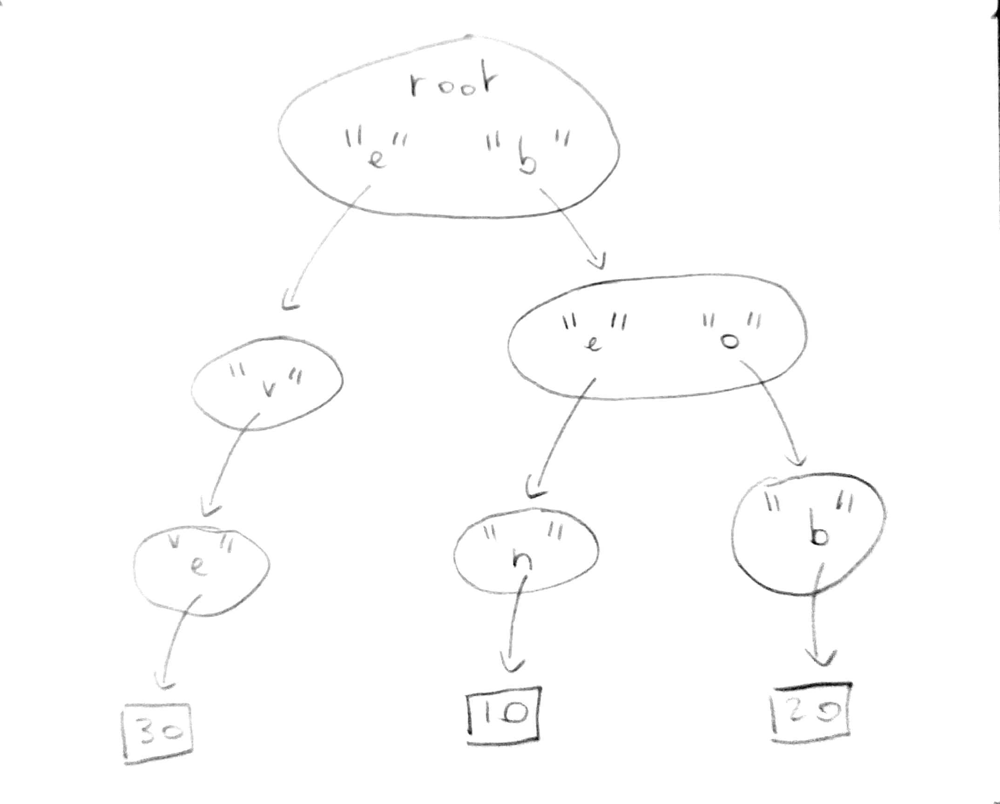
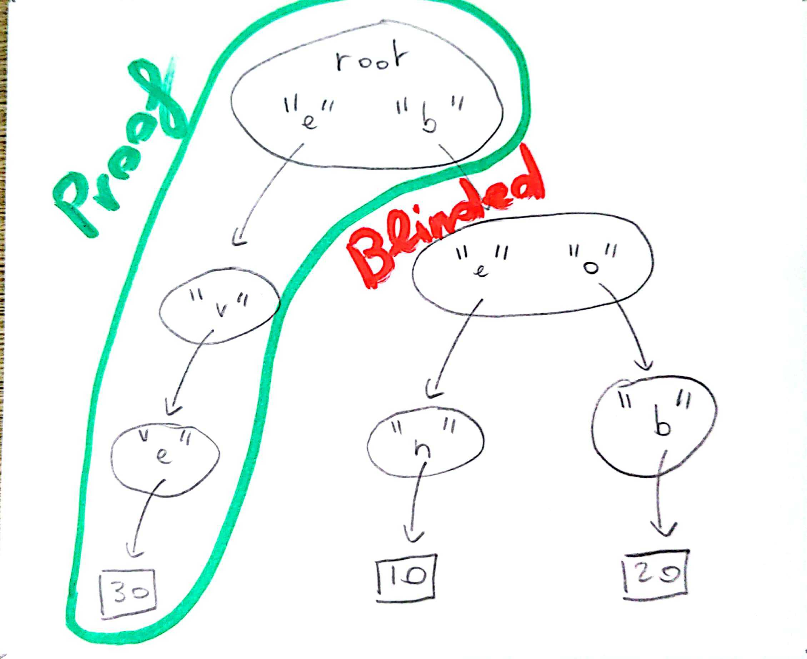

This example demonstrates the _Merkle proof_ feature of Irmin on the task of producing tamper-proof banking account statements.

From a high-level perspective, a Merkle proof is a set of paths in a Merkle tree where some subtrees are missing and replaced by their hash. A Merkle tree is simply a DAG where the hash of a node is derived from the hash of its children.

More specifically, for Irmin, a Merkle proof is the subset of a tree stored in a repo.

### Setting up a Bank

```ocaml
# #require "digestif.ocaml";;
# #require "checkseum.ocaml";;
# #require "irmin";;
# #require "irmin-git.unix";;
# #require "ppx_irmin";;
# open Lwt.Infix
  open Lwt.Syntax;;
```

First, create an irmin-unix store module which uses `int` as contents.

```ocaml
module Contents = struct
  type t = int [@@deriving irmin]

  let merge = Irmin.(Merge.idempotent Type.(option int))
end

module Store = Irmin_git_unix.FS.KV (Contents)
```

Open a repo.

```ocaml
# let config = Irmin_git.config ~bare:true "/tmp/irmin/test"
  let repo = Lwt_main.run (Store.Repo.v config);;
val config : Irmin.config = <abstr>
val repo : Store.repo = <abstr>
```

Create a tree which contains the accounts and their balance for 3 customers: Ben, Bob and Eve.

Instead of using `[ "eve" ]` as a path (which whould have been valid too), this example splits the names char by char. This is better in order to highlight how proofs work.

```ocaml
# let tree = Lwt_main.run (
    let tree = Store.Tree.empty () in
    let* tree = Store.Tree.add tree [ "b"; "e"; "n" ] 10 in
    let* tree = Store.Tree.add tree [ "b"; "o"; "b" ] 20 in
    let+ tree = Store.Tree.add tree [ "e"; "v"; "e" ] 30 in
    tree
  );;
val tree : Store.tree = <abstr>
```

In order to produce a Merkle proof, Irmin requires that the tree on which the proof will be based is persisted inside a `repo`. The following code block does so.

`tree_key` is a value that encodes where `tree` has been persisted inside the store's backend.

```ocaml
# let tree_key = Lwt_main.run (
    (* [batch] exposes [repo] stores in read-write mode *)
    let+ kinded_key = Store.Backend.Repo.batch repo
      (fun rw_contents_store rw_node_store _rw_commit_store ->
        Store.save_tree repo rw_contents_store rw_node_store tree)
    in
    (* As the root of [tree] is a node, refining the type is safe *)
    match kinded_key with
    | `Node key -> key
    | `Contents _ -> assert false
  );;
val tree_key : Store.node_key = <abstr>
```

The bank is ready. `repo` contains the data, which was persisted on disk. `tree_key` acts as a pointer to the root of the accounts tree.

Since this example only cares about account statements, there is no need to worry about modifying the account balances, this would be well expressed using Irmin's commit and branches abstraction, but this is out of the scope of this example.



### Producing Acccount Statements

Let's produce an account statement for Eve.

```ocaml
let visit_tree tree =
  (* [tree] is shallow. Let's only load the parts we are interested in *)
  let+ (_ : int option) = Store.Tree.find tree [ "e"; "v"; "e" ] in
  (Store.Tree.empty (), `Success)

let proof, `Success = Lwt_main.run (
  Store.Tree.produce_proof repo (`Node tree_key) visit_tree)

let pp_merkle_proof = Irmin.Type.pp Store.Tree.Proof.tree_t
```

```ocaml
# let () = Fmt.pr "proof: %a\n" pp_merkle_proof (Store.Tree.Proof.state proof);;
proof: {"Node":[["b",{"Blinded_node":"584ba234368730ce6cea56d93433a7a777cad2a0"}],["e",{"Node":[["v",{"Node":[["e",{"Contents":[30,"normal"]}]]}]]}]]}
```

The proof of Eve's balance is a Merkle proof. It is a path in the tree of all the accounts in the bank, it doesn't leaks Bob and Ben's balance, it only reveals the hash and the name of their subtree (i.e. `["b",{"Blinded_node":"584ba234368730ce6cea56d93433a7a777cad2a0"}]`).



The reason why this statement is tamper proof is because it hashes the same way as the full account tree of the bank. The bank could make public the hash in a trusted place and anyone could produce the hash of the statement and make sure that it is identical to the hash published by the bank.

```ocaml
let pp_hash = Irmin.Type.pp Store.hash_t
```

```ocaml
# let () =
    let bank_hash = Store.Tree.hash tree in
    Fmt.pr " bank hash: %a\n" pp_hash bank_hash

  let () =
    let proof_hash =
      match Store.Tree.(Proof.state proof |> hash_of_proof_state) with
      | `Node h -> h
      | `Contents _ -> assert false
    in
    Fmt.pr "proof hash: %a\n" pp_hash proof_hash
  ;;
 bank hash: 8e2d5291a09b98725e8525807d189eb7d9eb66d5
proof hash: 8e2d5291a09b98725e8525807d189eb7d9eb66d5
```

### `produce_proof` in details

Here is the signature of `produce_proof`:

```ocaml
# let produce_proof = Store.Tree.produce_proof;;
val produce_proof :
  Store.repo ->
  Store.Tree.kinded_key ->
  (Store.tree -> (Store.tree * 'a) Lwt.t) ->
  (Store.Tree.Proof.tree Store.Tree.Proof.t * 'a) Lwt.t = <fun>
```

`produce_proof repo key_before f` is `(proof = { state; hash_before; hash_after }, f_res)`. `f` is invoked once per call to `produce_proof` and `f tree_before` is `(tree_after, f_res)`.

`produce_proof` invokes `f`, passing it `tree_before` which is the tree at `key_before` in `repo`. In the preceding example, `tree_before` is the tree of all the bank accounts and `key_before` is the pointer in `repo` to the root of all the bank accounts.

`f` is expected to perform operations on `tree_before`. Irmin will record all these operations and remember which paths were loaded and which paths weren't. All operations in `Store.Tree` work! All of this is thread safe: behind the scene, instead of using global variables, `tree_before` is decorated with a local cache.

When `f` is done, Irmin computes `state`, which is the Merkle proof. The paths that were visited during `f` are exposed in `state`, and the paths that were not visited are blinded.

### Other use cases

The goal of the above example is to share `state` while `hash_before` is publically known, so that anyone can verify that both match, without knowing `repo`. `hash_after` and `tree_after` are unimportant for this task.

`hash_after` and `tree_after` are useful in tasks where the goal is to share `proof` and `f` while `hash_before` is publically known, so that anyone can verify that `f` applied on a tree that hashes to `hash_before` produces a tree that hashes to `hash_after`, without knowing `repo`. The `Store.Tree.verify_proof` function exists to support that use case.

Irmin's Merkle proofs are used in Tezos' _rollups_ where some peers need to verify what some other peers did in other blockchains.
